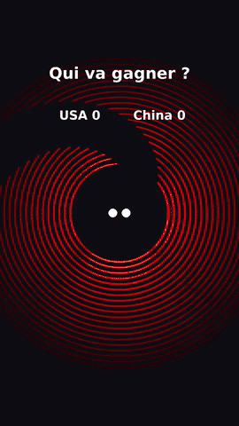

# ProjetGenerationTiktok

Générateur de vidéos verticales (format TikTok, 1080×1920, 60 ips) à partir d'une simulation physique écrite en Python avec Pygame.

Deux balles rebondissent à l'intérieur de 20 arcs de cercle concentriques qui tournent. Chaque fois qu'une balle passe par l'ouverture d'un arc, elle le détruit, marque un point, et les arcs restants se resserrent. La vidéo finale est exportée en `.mp4`, avec la musique et un son de rebond à chaque collision.

## Démo

<p align="center">
  
</p>

Chaque rebond tombe sur un temps fort de la musique. Version avec le son : [docs/demo.mp4](docs/demo.mp4)

## Application web : rebonds synchronisés sur ta musique

Une interface React permet d'importer n'importe quelle musique et de régler les paramètres. La vidéo TikTok est ensuite générée automatiquement :

```bash
docker compose up -d --build
```

Ouvre ensuite http://localhost:8080.

1. Glisse ta musique (mp3, wav, ogg, flac ou m4a, 50 Mo maximum).
2. Règle les paramètres. Un aperçu animé se met à jour en direct.
   - **Synchronisation** : sensibilité de détection, sélectivité (garder seulement les temps les plus forts), écart minimum entre deux rebonds, fréquence de destruction des arcs, son de rebond.
   - **Vidéo** : titre, durée maximale, 30 ou 60 ips, couleur de fond.
   - **Arcs** : nombre, rayon, espacement, ouverture, vitesse de rotation, épaisseur, dégradé de couleurs.
   - **Balles** : 1 à 4 balles, avec nom et couleur, taille, gravité, graine aléatoire.
3. Clique sur **Générer la vidéo**. Une barre de progression s'affiche, puis la vidéo apparaît avec un bouton de téléchargement.

**Comment les rebonds suivent la musique** ([`source/beat_render.py`](source/beat_render.py)) :
- librosa détecte les temps forts (*onsets*) du morceau et mesure leur force. Sur un morceau rapide, seuls les meilleurs sont gardés : les plus faibles sont écartés (**sélectivité**), et quand deux temps sont trop proches, le plus fort l'emporte (**écart minimum**). Les balles se partagent ensuite les temps retenus à tour de rôle.
- Après chaque rebond, la balle repart sous l'effet de la gravité. Parmi des dizaines de points d'impact possibles, le moteur choisit la parabole qui touche l'arc exactement au temps suivant et ressemble le plus au vrai rebond physique (réflexion sur la paroi).
- La gravité est adaptée au tempo pour que les vols soient de vraies paraboles. Le réglage de gravité sert de maximum.
- Quand il n'y a plus de temps fort à viser, les balles continuent en vol libre avec rebonds : elles ne s'arrêtent jamais.
- `python source/check_bounces.py musique.mp3` affiche, sans générer de vidéo, le nombre de temps retenus, la part de trajectoires sous gravité réelle et la vitesse minimale des balles.
- En moyenne un rebond sur N (par tirage aléatoire), la balle vise l'ouverture : elle traverse l'arc, le détruit et marque un point.

Le moteur s'utilise aussi en ligne de commande :

```bash
cd source
python beat_render.py ma_musique.mp3 --max-duration 30 --title "Qui va gagner ?"
```

### Mode « Plateformes »

Deuxième onglet de l'interface : une balle tombe sous gravité et rebondit sur des plateformes qui apparaissent au bon endroit, **sur le tempo du morceau** ([`source/platform_render.py`](source/platform_render.py)).

- **Sheet Sage 2 (moteur par défaut) :** [m-a-p/SheetSage2](https://huggingface.co/m-a-p/SheetSage2) relève la partition du morceau comme le ferait un musicien.
  - **Ce qu'il produit :** la mélodie (vocale ou instrumentale), les accords, les temps, les débuts de mesure, la tonalité et la structure.
  - **Dans la vidéo :** chaque note de mélodie donne un rebond, les accords servent d'accompagnement doux, le fond pulse sur les temps détectés et la caméra zoome légèrement à chaque début de mesure.
  - **Service séparé :** il tourne dans son propre conteneur (`web/transcriber/`), car il exige des versions précises de PyTorch, transformers et numpy.
  - **Coût et cache :** compter environ 2 minutes de calcul par minute de musique la première fois. Chaque morceau est ensuite gardé en cache, donc les vidéos suivantes, quels que soient les réglages, sont immédiates.
  - **Licence :** CC BY-NC 4.0, usage **non commercial** uniquement.
  - **Comparaison :** le notebook [`experiments/transcription/comparaison_transcription.ipynb`](experiments/transcription/comparaison_transcription.ipynb) compare toutes les approches essayées (Basic Pitch, Demucs, Pop2Piano, hybride, Viterbi, YourMT3+, Sheet Sage 2).
- **Basic Pitch (moteur rapide) :** toute la musique est transcrite en notes par [Basic Pitch](https://github.com/spotify/basic-pitch) (Spotify), via le modèle ONNX.
  - Chaque note ou accord, c'est-à-dire des notes qui commencent ensemble, donne **un rebond**.
  - Le piano rejoue toutes les notes transcrites, avec leur durée et leur intensité réelles : la musique reste reconnaissable.
  - Les notes trop rapprochées (moins de 0,15 s, réglable) partagent le même rebond.
  - Exemple : 30 s de *Pirates des Caraïbes* donnent 228 notes et 107 rebonds.
- **Mélodie principale (par défaut) :** sur un morceau à plusieurs instruments, le piano ne joue pas tout.
  - **Choix des notes :** parmi les notes transcrites, il garde la plus marquante à chaque instant (intensité × durée, tessiture C3–E6, cordes graves comprises), avec une pénalité pour les grands sauts afin que la ligne reste cohérente. Les notes les moins marquantes sont écartées (**sélectivité de la mélodie**).
  - **Accompagnement :** l'accord joué par l'ensemble des instruments, en favorisant la tonalité, est rejoué doucement dans le grave, seulement quand il change.
  - **Pauses :** pendant une pause de la mélodie, des rebonds silencieux sur des plateformes discrètes évitent les sauts géants hors de l'écran.
  - **Octaves :** chaque note est ramenée à l'octave la plus proche de la précédente, car un thème doublé grave + aigu ferait sauter la mélodie de registre.
  - **Exemple :** sur 1 minute de *Pirates des Caraïbes*, 472 notes transcrites donnent 150 notes de mélodie.
- **Vitesse de lecture (×0,25 à ×1) :** ralentit tout pour mieux entendre les notes rapides : notes, rebonds, plateformes et musique d'origine (filtre `atempo` de ffmpeg, à hauteur constante). L'écart minimum entre rebonds s'applique à la vidéo ralentie : ralentir sépare donc les notes qui partageaient un rebond.
- **Rythme (autres modes) :** librosa détecte la pulsation (BPM) au cours du temps : la grille suit les accélérations et ralentissements du morceau. La balle rebondit tous les 1, 2 ou 4 temps selon l'écart minimum choisi, calée sur les temps les plus forts. Un mode « attaques » suit plutôt les temps forts les plus marqués.
- **Plateformes :** chacune est orientée pour renvoyer la balle vers la suivante. La trajectoire est une vraie parabole sous gravité constante.
- **Effets :** apparition des plateformes avec ralenti de fin de mouvement, puis flash, onde de choc, particules et tremblement à l'impact. S'y ajoutent la traînée lumineuse, la caméra qui suit la balle, le fond qui pulse sur chaque temps, un petit zoom à chaque mesure et des couleurs en dégradé.
- **Réglages :** tous ces effets se règlent dans l'onglet.

```bash
cd source
python platform_render.py ma_musique.mp3 --max-duration 30
```

### Piano : accords détectés dans la musique

Chaque rebond peut jouer au piano les accords du morceau ([`source/piano.py`](source/piano.py)). Dans l'onglet Plateformes, c'est le réglage par défaut : **piano seul, sans la musique d'origine**.

- **Accords :** entre deux rebonds, l'énergie des 12 notes (chroma, avec correction de l'accordage) est comparée aux 24 accords majeurs et mineurs.
  - Les accords de la tonalité du morceau, estimée avec les profils de Krumhansl, sont légèrement favorisés.
  - L'accord ne change que si le nouveau l'emporte nettement.
  - Exemple : sur *Pirates des Caraïbes*, l'application trouve ré mineur et la grille Dm – Am – Bb – F – C – Gm.
- **Batterie retirée :** la partie percussive est séparée (HPSS) avant l'analyse, et seuls les vrais pics du spectre comptent. Les accords restent justes même avec une batterie forte ou des notes très courtes.
- **Pas d'harmonie :** sur un morceau sans harmonie exploitable (batterie seule, voix parlée…), le piano joue une progression par défaut (Am – F – C – G) au lieu d'inventer de faux accords.
- **Jeu :** l'accord est joué avec sa basse. Les renversements sont choisis pour que les voix bougent le moins possible d'un accord à l'autre.
- **Note seule :** il est aussi possible de jouer seulement la note dominante, la plus présente à cet instant.
- **Son :** le piano est synthétisé (harmoniques, attaque de marteau, aigus plus courts). Il ne demande aucun fichier de sons.
- **Réglages :** piano seul, piano + musique ou désactivé ; accords ou note seule ; volume.
- **Affichage :** dans l'onglet Plateformes, chaque plateforme prend la couleur de la fondamentale de son accord et affiche son nom.

| Service | Rôle |
|---|---|
| `frontend` | React (Vite) servi par nginx sur le port 8080, qui redirige `/api` vers l'API |
| `transcriber` | Sheet Sage 2 : transcription mélodie + accords, modèle chargé une fois, résultats en cache par morceau |
| `api` | Flask + gunicorn : reçoit la musique, met les rendus en file d'attente, sert les vidéos (les 20 dernières sont conservées) |

## Rendu simple en ligne de commande (Docker)

Ce mode rejoue la simulation d'origine, sans synchronisation sur la musique. Il n'y a ni écran ni carte son à configurer : la vidéo est calculée image par image dans le conteneur.

```bash
docker build -t tiktok-generator .
docker run --rm -v "$(pwd)/VideoResult:/app/VideoResult" tiktok-generator
```

La vidéo est écrite dans `VideoResult/tiktok.mp4`.

Options disponibles :

```bash
docker run --rm -v "$(pwd)/VideoResult:/app/VideoResult" tiktok-generator \
  --duration 20 --seed 7 --output /app/VideoResult/ma_video.mp4
```

| Option | Rôle | Défaut |
|---|---|---|
| `--duration` | Durée maximale en secondes. La vidéo s'arrête 1 s après la destruction du dernier arc. | `30` |
| `--seed` | Graine aléatoire pour reproduire exactement la même vidéo | aléatoire |
| `--output` | Chemin du fichier `.mp4` | `VideoResult/tiktok.mp4` |

> Sous Windows PowerShell, remplace `$(pwd)` par `${PWD}`.

## Lancer sans Docker

Il faut Python 3.10 et ffmpeg installé sur la machine.

```bash
pip install -r requirements-render.txt
cd source
python render.py
```

Le script d'origine `source/gen_vidéo_IA.py` reste disponible. Il affiche la simulation dans une fenêtre et l'enregistre en temps réel, ce qui demande un écran, une carte son et le périphérique « Stereo Mix ». Ses dépendances sont dans `requirements.txt`.

## Comment ça marche

> Fonctionnement détaillé de l'onglet Plateformes (transcription, vérification de la partition, rebonds, piano) : [docs/FONCTIONNEMENT.md](docs/FONCTIONNEMENT.md)

1. **Simulation** ([`source/bouncing1v1`](source/bouncing1v1)) :
   - `Ball` gère la gravité, les rebonds et les collisions élastiques entre les deux balles (calcul d'impulsion le long de la normale).
   - `ArcWall` détecte si une balle touche l'arc ou passe par son ouverture.
2. **Rendu headless** ([`source/render.py`](source/render.py)) : Pygame dessine chaque image hors écran (`SDL_VIDEODRIVER=dummy`), puis les images sont envoyées directement à ffmpeg (H.264).
3. **Bande-son** : chaque rebond est noté avec son numéro d'image. La musique est ensuite reconstruite avec pydub, en superposant le son de rebond au moment exact de chaque collision. Le son est donc parfaitement synchronisé avec l'image, sans enregistrer la carte son.
4. **Fusion** : ffmpeg assemble la vidéo et l'audio dans le fichier final.

## Structure

```
.
├── docker-compose.yml          # application web (frontend + api)
├── Dockerfile                  # image de rendu headless (ligne de commande)
├── experiments/transcription/  # essais de transcription + notebook de comparaison
├── web/
│   ├── backend/                # API Flask (file d'attente des rendus)
│   ├── transcriber/            # service Sheet Sage 2
│   └── frontend/               # interface React + aperçu animé
├── requirements-render.txt     # dépendances minimales du rendu (Docker)
├── requirements.txt            # dépendances du script interactif d'origine
├── bin/                        # musique et son de rebond
├── docs/                       # démo (GIF et MP4)
└── source/
    ├── beat_render.py          # mode Arcs, synchronisé sur la musique (utilisé par l'API)
    ├── platform_render.py      # mode Plateformes, synchronisé sur le tempo (utilisé par l'API)
    ├── piano.py                # accords, notes et piano synthétisé
    ├── transcribe.py           # transcription en notes (Basic Pitch) et regroupement en rebonds
    ├── sheetsage_client.py     # appel du service de transcription Sheet Sage 2
    ├── check_bounces.py        # mesures du mode Arcs sans générer de vidéo
    ├── render.py               # rendu de la simulation d'origine sans écran
    ├── gen_vidéo_IA.py         # version interactive d'origine (fenêtre + enregistrement)
    ├── bouncing1v1/            # physique : balles et arcs
    ├── audio_image_scripts/    # dégradés de couleurs, fusion audio/vidéo
    └── musicbouncing/          # détection des temps forts de la musique (librosa)
```

## Technologies

Python, Pygame, librosa, NumPy, pydub, ffmpeg (imageio-ffmpeg), Flask, React, Vite, nginx, Docker Compose
