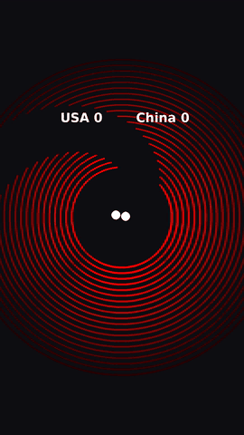
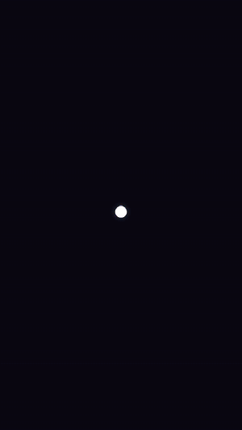

# ProjetGenerationTiktok

Générateur de vidéos verticales (format TikTok, 1080×1920, 60 ips) synchronisées sur la musique, à partir d'une simulation physique écrite en Python avec Pygame. Une application web (React + Flask, Docker Compose) propose deux modes :

- **Arcs** : des balles rebondissent à l'intérieur d'arcs de cercle concentriques qui tournent, chaque rebond tombant sur un temps fort du morceau. Quand une balle passe par l'ouverture d'un arc, elle le détruit et marque un point.
- **Plateformes** : la partition du morceau (mélodie et accords) est obtenue depuis un fichier MIDI fourni ou transcrite par IA (Sheet Sage 2), vérifiée sur l'audio, puis rejouée au piano. Une balle rebondit sur une plateforme à chaque note.

## Démo

<p align="center">
  
</p>

Chaque rebond tombe sur un temps fort de la musique. Version avec le son : [docs/demo.mp4](docs/demo.mp4)

### Test sur 10 secondes de Pirates des Caraïbes

<table align="center">
  <tr>
    <th>Arcs : rebonds sur les parois</th>
    <th>Plateformes : partition jouée au piano</th>
  </tr>
  <tr>
    <td></td>
    <td></td>
  </tr>
  <tr>
    <td>14 temps forts détectés : chaque rebond sur une paroi tombe sur l'un d'eux.<br><a href="docs/demo_pirates_arcs.mp4">Vidéo avec le son</a></td>
    <td>Partition transcrite par Sheet Sage 2 et vérifiée sur l'audio : 51 notes de mélodie, 10 accords, une plateforme par note.<br><a href="docs/demo_pirates_partition.mp4">Vidéo avec le son (piano seul)</a></td>
  </tr>
</table>

Les GIF sont muets : ouvre les vidéos pour entendre la synchronisation. Détail du fonctionnement : [docs/FONCTIONNEMENT.md](docs/FONCTIONNEMENT.md).

## Application web : rebonds synchronisés sur ta musique

Une interface React permet d'importer n'importe quelle musique et de régler les paramètres. La vidéo TikTok est ensuite générée automatiquement :

```bash
docker compose up -d --build
```

Ouvre ensuite http://localhost:8080.

1. Glisse ta musique (mp3, wav, ogg, flac ou m4a, 50 Mo maximum). Dans l'onglet Plateformes, tu peux aussi ajouter sa partition MIDI.
2. Règle les paramètres. Un aperçu animé se met à jour en direct. Pour l'onglet Arcs :
   - **Synchronisation** : sensibilité de détection, sélectivité (garder seulement les temps les plus forts), écart minimum entre deux rebonds, fréquence de destruction des arcs, son de rebond.
   - **Vidéo** : titre, durée maximale, 30 ou 60 ips, couleur de fond.
   - **Arcs** : nombre, rayon, espacement, ouverture, vitesse de rotation, épaisseur, dégradé de couleurs.
   - **Balles** : 1 à 4 balles, avec nom et couleur, taille, gravité, graine aléatoire.
3. Clique sur **Générer la vidéo**. Une barre de progression s'affiche, puis la vidéo apparaît avec un bouton de téléchargement.

**Comment les rebonds suivent la musique** ([`source/beat_render.py`](source/beat_render.py)) :
- librosa détecte les temps forts (*onsets*) du morceau et mesure leur force. Sur un morceau rapide, seuls les meilleurs sont gardés : les plus faibles sont écartés (**sélectivité**), et quand deux temps sont trop proches, le plus fort l'emporte (**écart minimum**). Les balles se partagent ensuite les temps retenus à tour de rôle.
- Après chaque rebond, la balle repart sous l'effet de la gravité. Parmi des dizaines de points d'impact possibles, le moteur choisit la parabole qui touche l'arc exactement au temps suivant et ressemble le plus au vrai rebond physique (réflexion sur la paroi).
- La gravité est adaptée au tempo pour que les vols soient de vraies paraboles. Le réglage de gravité sert de maximum.
- Quand il n'y a plus de temps fort à viser, les balles continuent en vol libre avec rebonds : elles ne s'arrêtent jamais.
- `python source/check_bounces.py musique.mp3` affiche, sans générer de vidéo, le nombre de temps retenus, la part de trajectoires sous gravité réelle et la vitesse minimale des balles.
- En moyenne un rebond sur N (par tirage aléatoire), la balle vise l'ouverture : elle traverse l'arc, le détruit et marque un point.

Le moteur s'utilise aussi en ligne de commande :

```bash
cd source
python beat_render.py ma_musique.mp3 --max-duration 30 --title "Qui va gagner ?"
```

### Mode « Plateformes » : la partition jouée au piano

Deuxième onglet de l'interface ([`source/platform_render.py`](source/platform_render.py)). Une balle tombe sous gravité et rebondit sur une plateforme à chaque note de la mélodie, pendant que le piano rejoue la partition. Le fonctionnement complet, étape par étape, est décrit dans [docs/FONCTIONNEMENT.md](docs/FONCTIONNEMENT.md).

1. **Obtenir la partition**
   - **Partition MIDI (facultatif)** : si tu fournis le fichier `.mid` du morceau, ses notes exactes sont calées automatiquement sur l'enregistrement par alignement DTW sur les chromas ([`source/score_align.py`](source/score_align.py)). Elle n'est utilisée que si elle couvre le morceau et que la moitié au moins de ses notes s'entendent vraiment dans l'audio ; sinon, retour automatique à la transcription.
   - **Sheet Sage 2 (par défaut)** : [m-a-p/SheetSage2](https://huggingface.co/m-a-p/SheetSage2) relève la mélodie, les accords, les temps, les débuts de mesure et la tonalité, comme le ferait un musicien. Il tourne dans son propre conteneur (`web/transcriber/`). Compter environ 2 minutes de calcul par minute de musique la première fois ; chaque morceau est ensuite en cache, donc les vidéos suivantes sont immédiates, quels que soient les réglages. Licence CC BY-NC 4.0 : usage **non commercial** uniquement.
   - **Basic Pitch (moteur rapide)** : [Basic Pitch](https://github.com/spotify/basic-pitch) (Spotify) transcrit toutes les notes, puis la mélodie est extraite par programmation dynamique (la note la plus marquante à chaque instant, sans grands sauts) et les accords sont déduits avec la tonalité.
   - Le notebook [`experiments/transcription/comparaison_transcription.ipynb`](experiments/transcription/comparaison_transcription.ipynb) compare toutes les approches essayées (Basic Pitch, Demucs, Pop2Piano, hybride, Viterbi, YourMT3+, Sheet Sage 2).
2. **Vérifier la partition sur l'audio** : la batterie est retirée et l'énergie de chaque demi-ton est mesurée dans le temps. Deux notes voisines inversées sont remises dans l'ordre, et chaque note est recalée sur l'attaque réelle où sa hauteur apparaît le plus nettement.
3. **Une plateforme par note** : chaque note de mélodie donne un rebond ; les notes plus proches que l'écart minimum (0,07 s par défaut) partagent un rebond mais restent jouées à leur moment. La plateforme affiche le nom de la note et prend la couleur de l'accord en cours.
4. **Synchronisation précise** : le contact avec la plateforme est calculé à l'instant exact de la note, sans arrondi à l'image (60 ips par défaut). L'image peut être légèrement avancée sur le son (« avance de l'image », 0,06 s par défaut) pour compenser la perception de l'œil.
5. **Piano** : chaque note est synthétisée (harmoniques, attaque de marteau, aigus plus courts, aucun fichier de sons) et placée à l'échantillon près. Par défaut, **piano seul** : mélodie + accords plus doux, sans la musique d'origine.
6. **Vitesse de lecture (×0,25 à ×1)** : ralentit notes, rebonds et musique (filtre `atempo` de ffmpeg, à hauteur constante) pour mieux suivre les passages rapides.

**Autres synchronisations** (réglage « Synchronisation ») : rebonds sur la pulsation (tempo suivi au cours du temps, un rebond tous les 1, 2 ou 4 temps) ou sur les attaques les plus marquées. La note de chaque rebond est alors détectée dans l'audio ([`source/piano.py`](source/piano.py)) : accord parmi les 24 majeurs et mineurs, en favorisant la tonalité estimée, ou note dominante seule.

**Effets** : plateformes qui apparaissent avant le rebond, flash, onde de choc, particules et tremblement à l'impact, traînée lumineuse, caméra qui suit la balle, fond qui pulse sur chaque temps et petit zoom à chaque mesure. Tout se règle dans l'onglet.

```bash
cd source
python platform_render.py ma_musique.mp3 --max-duration 30
python platform_render.py ma_musique.mp3 --max-duration 30 --score-path partition.mid   # avec la partition
```

### Services Docker

| Service | Rôle |
|---|---|
| `frontend` | React (Vite) servi par nginx sur le port 8080, qui redirige `/api` vers l'API |
| `transcriber` | Sheet Sage 2 : transcription mélodie + accords, modèle chargé une fois, résultats en cache par morceau |
| `api` | Flask + gunicorn : reçoit la musique, met les rendus en file d'attente, sert les vidéos (les 20 dernières sont conservées) |

## Rendu simple en ligne de commande (Docker)

Ce mode rejoue la simulation d'origine, sans synchronisation sur la musique. Il n'y a ni écran ni carte son à configurer : la vidéo est calculée image par image dans le conteneur.

```bash
docker build -t tiktok-generator .
docker run --rm -v "$(pwd)/VideoResult:/app/VideoResult" tiktok-generator
```

La vidéo est écrite dans `VideoResult/tiktok.mp4`.

Options disponibles :

```bash
docker run --rm -v "$(pwd)/VideoResult:/app/VideoResult" tiktok-generator \
  --duration 20 --seed 7 --output /app/VideoResult/ma_video.mp4
```

| Option | Rôle | Défaut |
|---|---|---|
| `--duration` | Durée maximale en secondes. La vidéo s'arrête 1 s après la destruction du dernier arc. | `30` |
| `--seed` | Graine aléatoire pour reproduire exactement la même vidéo | aléatoire |
| `--output` | Chemin du fichier `.mp4` | `VideoResult/tiktok.mp4` |

> Sous Windows PowerShell, remplace `$(pwd)` par `${PWD}`.

## Lancer sans Docker

Il faut Python 3.10 et ffmpeg installé sur la machine.

```bash
pip install -r requirements-render.txt
cd source
python render.py
```

Le script d'origine `source/gen_vidéo_IA.py` reste disponible. Il affiche la simulation dans une fenêtre et l'enregistre en temps réel, ce qui demande un écran, une carte son et le périphérique « Stereo Mix ». Ses dépendances sont dans `requirements.txt`.

## Comment ça marche (simulation d'origine)

> Fonctionnement détaillé de l'onglet Plateformes (transcription, vérification de la partition, rebonds, piano) : [docs/FONCTIONNEMENT.md](docs/FONCTIONNEMENT.md)

1. **Simulation** ([`source/bouncing1v1`](source/bouncing1v1)) :
   - `Ball` gère la gravité, les rebonds et les collisions élastiques entre les deux balles (calcul d'impulsion le long de la normale).
   - `ArcWall` détecte si une balle touche l'arc ou passe par son ouverture.
2. **Rendu headless** ([`source/render.py`](source/render.py)) : Pygame dessine chaque image hors écran (`SDL_VIDEODRIVER=dummy`), puis les images sont envoyées directement à ffmpeg (H.264).
3. **Bande-son** : chaque rebond est noté avec son numéro d'image. La musique est ensuite reconstruite avec pydub, en superposant le son de rebond au moment exact de chaque collision. Le son est donc parfaitement synchronisé avec l'image, sans enregistrer la carte son.
4. **Fusion** : ffmpeg assemble la vidéo et l'audio dans le fichier final.

## Structure

```
.
├── docker-compose.yml          # application web (frontend + api + transcriber)
├── Dockerfile                  # image de rendu headless (ligne de commande)
├── experiments/transcription/  # essais de transcription + notebook de comparaison
├── web/
│   ├── backend/                # API Flask (file d'attente des rendus)
│   ├── transcriber/            # service Sheet Sage 2
│   └── frontend/               # interface React + aperçu animé
├── requirements-render.txt     # dépendances minimales du rendu (Docker)
├── requirements.txt            # dépendances du script interactif d'origine
├── bin/                        # musique et son de rebond
├── docs/                       # démos (GIF et MP4) et FONCTIONNEMENT.md (workflow détaillé)
└── source/
    ├── beat_render.py          # mode Arcs, synchronisé sur la musique (utilisé par l'API)
    ├── platform_render.py      # mode Plateformes : partition vérifiée, rebonds, rendu (utilisé par l'API)
    ├── score_align.py          # partition MIDI fournie, calée sur l'audio (DTW)
    ├── sheetsage_client.py     # appel du service de transcription Sheet Sage 2
    ├── transcribe.py           # transcription Basic Pitch, extraction de la mélodie, regroupement en rebonds
    ├── piano.py                # détection d'accords et de notes, piano synthétisé
    ├── check_bounces.py        # mesures du mode Arcs sans générer de vidéo
    ├── render.py               # rendu de la simulation d'origine sans écran
    ├── gen_vidéo_IA.py         # version interactive d'origine (fenêtre + enregistrement)
    ├── bouncing1v1/            # physique : balles et arcs
    ├── audio_image_scripts/    # dégradés de couleurs, fusion audio/vidéo
    └── musicbouncing/          # détection des temps forts de la musique (librosa)
```

## Technologies

Python, Pygame, librosa, NumPy, pydub, ffmpeg (imageio-ffmpeg), Sheet Sage 2 (PyTorch, transformers), Basic Pitch (ONNX), pretty_midi, Flask, React, Vite, nginx, Docker Compose
